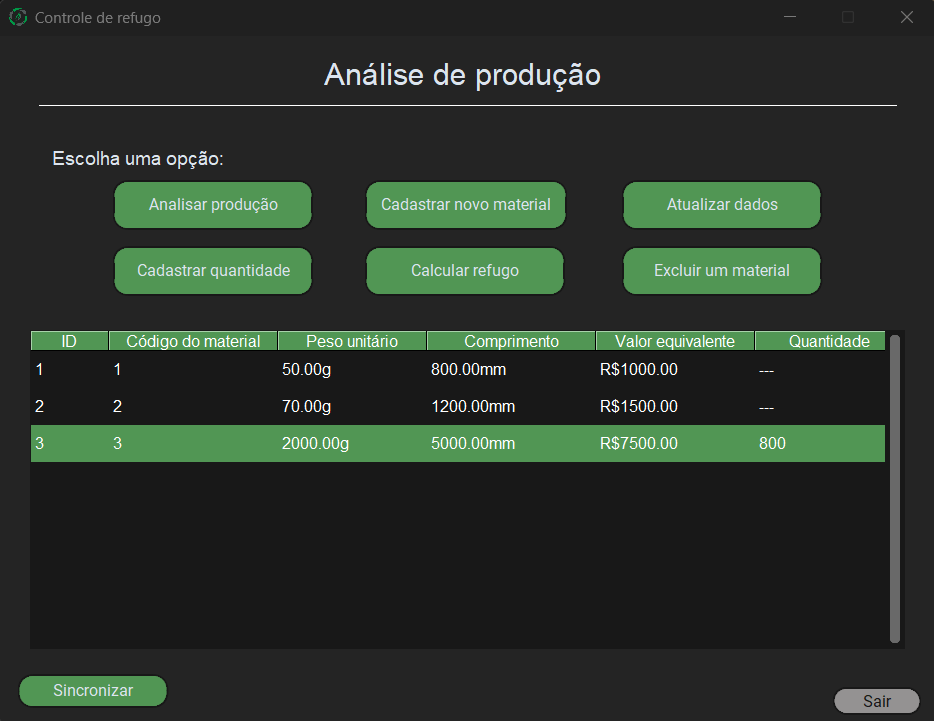

# Controle de Refugo

Sistema para gerenciamento e controle de refugo industrial desenvolvido em Python com interface gráfica (CustomTkinter).



## Funcionalidades

- Cadastro de materiais e quantidades.
- Visualização de registros salvos.
- Interface com temas (Dark/Light).
- Banco de dados local (SQLite).

## Instalação e Execução

1. Clone o repositório:
  ```bash
  git clone https://github.com/Bilhao/Controle-Refugo.git
  ```
   
2. Instale as dependências:

  ```bash
  pip install -r requirements.txt
  ```

3. Execute o sistema:

  ```bash
  python controle_refugo/main.py
  ```

## Estrutura dos Arquivos
- controle_refugo/: Aplicação principal (GUI).
- terminal_app/: Versão para linha de comando.
- data/: Arquivos de banco de dados.
---
